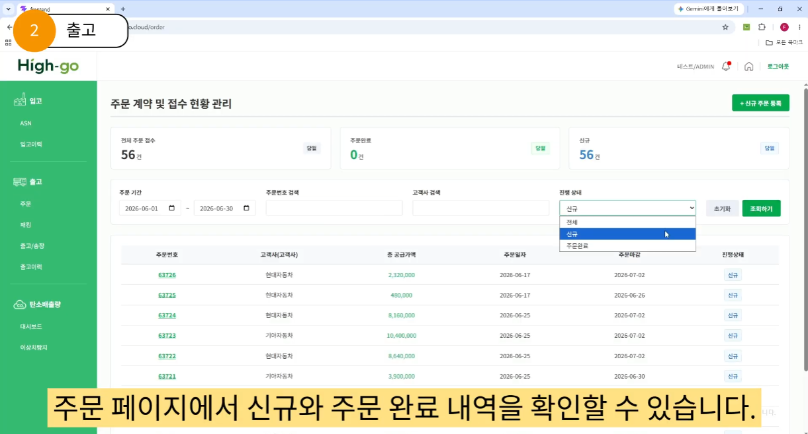
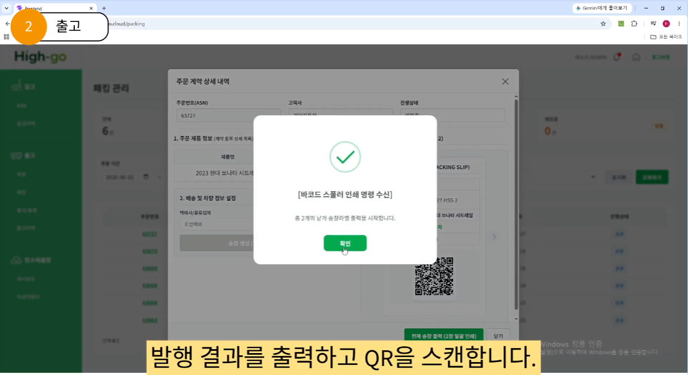
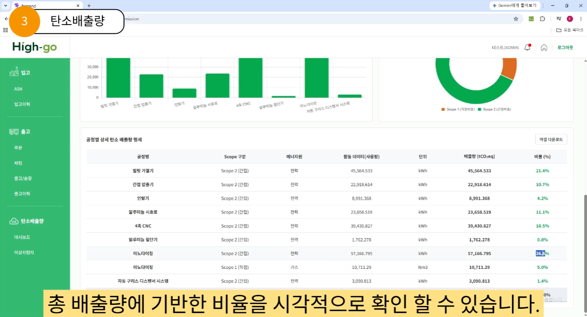
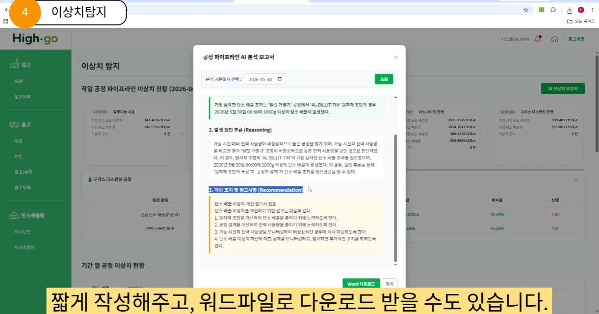
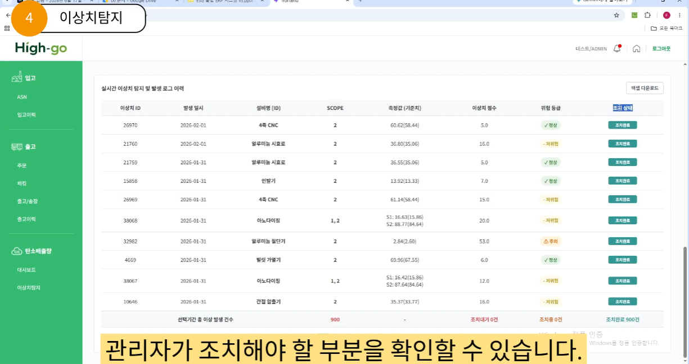
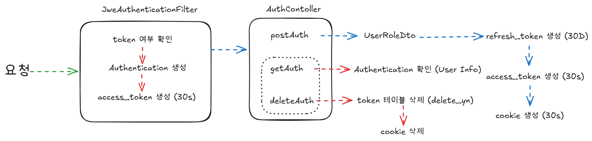
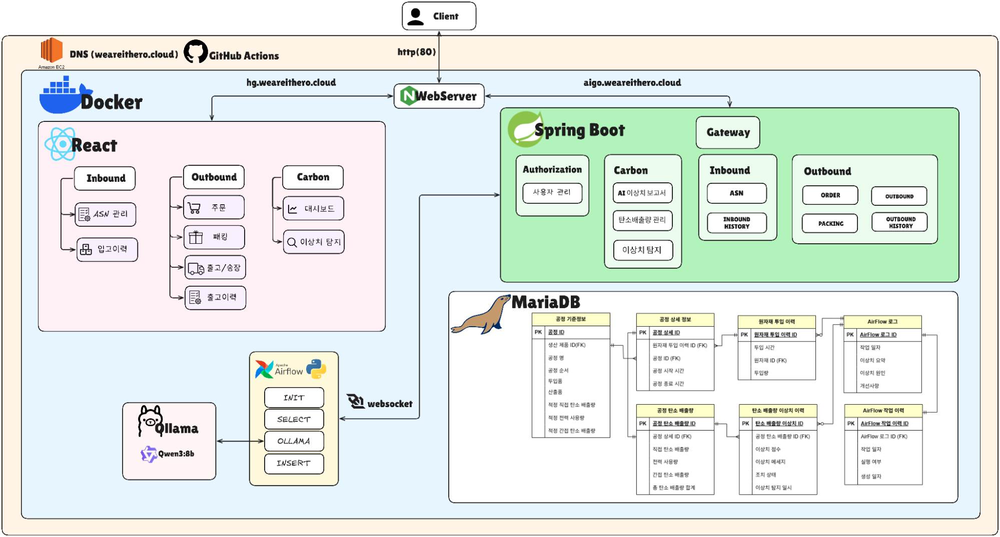

# ERP와 탄소배출량 대응을 위한 탄소 관리 시스템

## 1. 프로젝트 소개 

### TEAM HighGo

> 제조업 중 알루미늄 인발을 사용한
> 시트레일 입출고 ERP 데이터를 기반으로
> 탄소배출량 이상치를 자동 산정하고,
> 공정 과정, 설비 등에서 발생 원인을 탐지하며,
> AI Agent를 통해 요약, 원인, 개선권고 사항이 담긴
> 이상치 탐지 보고서를 자동 생성하는
> AI 기반 ESG 통합 운영 플랫폼 

---

## 2. 서비스 화면

---

## 3.시스템 아키텍처

---

## 4. 기술 스택

| 분류 | 기술 |
|------------|------|
| FE | React (Vite) / Redux Toolkit / Chart.js / axios / docx / xlsx / qrcode |
| BE | JAVA 21 / Spring Boot 3.5.15 / Spring Cloud Gateway / Spring Security / Spring Authorization Server / OAuth2 Resource Server / Nimbus JOSE JWT / Spring Mail (Gmail) / Spring WebSocket (STOMP) / SpringDoc Swagger UI / Lombok |
| DB | MariaDB / MyBatis /JPA / Redis |
| AI | Ollama / Airflow / Python 3.12+ |
| INFRA | AWS EC2 / Docker Container / GitHub Actions |

---

## 5. 핵심 기술

| 핵심 기술 | 사용 근거 |
|------------|------|
| Airflow | ETL 자동화와 DAG 기반 워크플로우 관리 |
| Ollama | 외부 API 없이 기업 내부 데이터를 안전하게 처리 |
| Spring Boot | 안정적인 엔터프라이즈 백엔드 구축 |

---

## 6. 팀 소개

### 조윤주 (PM / Full Stack)
- 프로젝트 관리
- 출고 기능 FE·BE 개발
- AI Agent 개발
### 김지환 (FE Lead / Full Stack)
- 웹/기능 기획 및 디자인
- 리액트와 API 구현
- 출고 기능 FE·BE 개발
### 최가영 (DB Lead / Full Stack)
- DB 스키마 정의 및 데이터 셋 구축
- ESG 도메인 리드
- 탄소배출량 기능 FE·BE 개발
### 최윤우 (BE Lead / Full Stack)
- Spring Boot API 설계 총괄
- 입고/출고 기능 FE·BE 개발
- CI/CD 담당